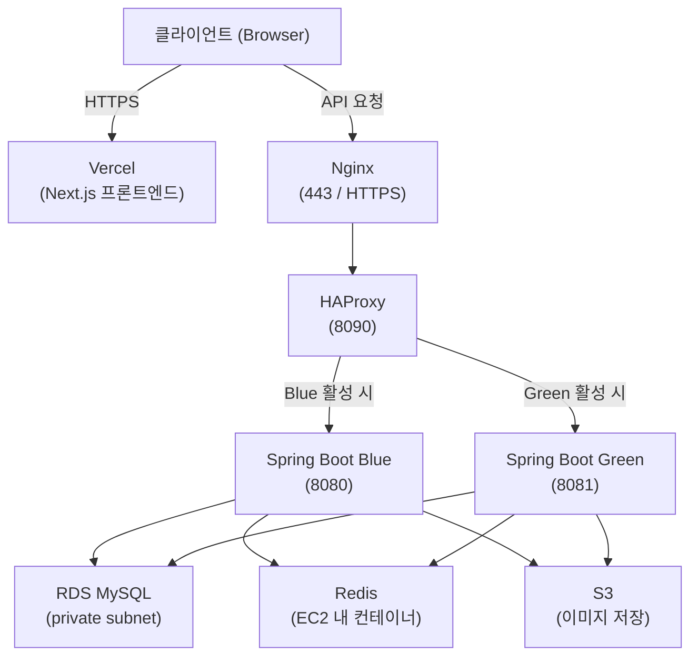
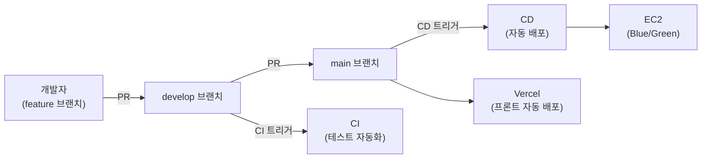

# PopSpot

## 시스템 아키텍처

```mermaid
graph TD
    Client["클라이언트 (Browser)"]
    Vercel["Vercel\n(Next.js 프론트엔드)"]
    Nginx["Nginx\n(443 / HTTPS)"]
    HAProxy["HAProxy\n(8090)"]
    Blue["Spring Boot Blue\n(8080)"]
    Green["Spring Boot Green\n(8081)"]
    RDS["RDS MySQL\n(private subnet)"]
    Redis["Redis\n(EC2 내 컨테이너)"]
    S3["S3\n(이미지 저장)"]

    Client -->|HTTPS| Vercel
    Client -->|API 요청| Nginx
    Nginx --> HAProxy
    HAProxy -->|Blue 활성 시| Blue
    HAProxy -->|Green 활성 시| Green
    Blue --> RDS
    Blue --> Redis
    Blue --> S3
    Green --> RDS
    Green --> Redis
    Green --> S3
```

## 배포 구조

```mermaid
graph LR
    Dev["개발자\n(feature 브랜치)"]
    Develop["develop 브랜치"]
    Main["main 브랜치"]
    CI["CI\n(테스트 자동화)"]
    CD["CD\n(자동 배포)"]
    EC2["EC2\n(Blue/Green)"]
    VercelDeploy["Vercel\n(프론트 자동 배포)"]

    Dev -->|PR| Develop
    Develop -->|CI 트리거| CI
    Develop -->|PR| Main
    Main -->|CD 트리거| CD
    CD --> EC2
    Main --> VercelDeploy
```